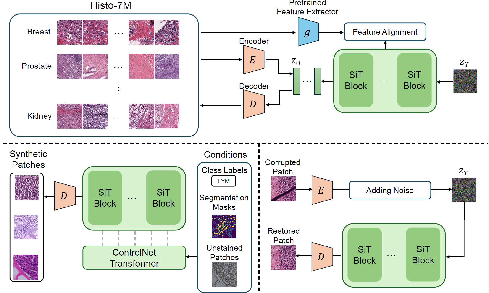

# HistoDiffusion++: A Generative Visual Foundation Model for Histopathology

This is the official repository for paper "HistoDiffusion++: A Generative Visual Foundation Model for Histopathology". [[paper]](https://www.sciencedirect.com/science/article/pii/S136184152600397X)




<br/>

<!-- ## 🔥 News
- **Sep. 2026**: Released first version of code on GitHub. -->

## 📝 TODO
- [ ] Release codes for nuclei segmentation, virtual staining and artifact restoration
- [ ] Release checkpoints on Hugging Face
- [ ] Release Histo-7M on Hugging Face
- [ ] Release models compatible with the Diffusers library

## 📜 Highlight

- We present **HistoDiffusion++**, a multi-magnification generative visual foundation model for histopathology. 
- We pretrain the model on **Histo-7M**, a large-scale dataset of **7.4 million patches** from **38,373 whole-slide images (WSIs)** spanning 33 cancer types and 12 organs/organ systems at multiple magnifications.
- We evaluate HistoDiffusion++ on two tracks: synthetic augmentation and image-to-image translation. For augmentation, our model improves **tissue classification** and **nuclei segmentation** performance beyond baseline strategies. For translation, it achieves promising results in **virtual staining** and **artifact restoration**


## 🔧 Dependencies and Installation
- python >=3.10
- PyTorch >= 2.6.0 + CUDA 12.6

```bash
conda create -n histo python=3.10
conda activate histo
git clone https://github.com/PengJin95/HistoDiffusion_Plusplus
cd HistoDiffusion_Plusplus
pip install -r requirements.txt
```

## 📂 Dataset Preparation
We pretrain HistoDiffusion on Histo-7M. The WSIs are extracted from TCGA, CPTAC and PAIP. The data prerparation scripts and instructions can be found in `scripts/data_preparation`.

We also plan to upload the Histo-7M to Hugging Face soon.

## 🚀 Training

1. Before training, you can download the pretrained [UNI](https://huggingface.co/MahmoodLab/UNI) or [CONCH](https://huggingface.co/MahmoodLab/CONCH) checkpoint for representation alignment. Make sure to change the corresponding paths in `load_encoders()` of `utils.py`.

2. Launch training using the following command:
```bash
python train.py --output-dir exp_repa/run1 \
    --allow-tf32 --exp-name=run1 --batch-size 64 \
    --max-train-steps 180000 --proj-coeff 0.5 \
    --gradient-accumulation-steps 4
```

We also provide a slurm script for multi-node multi-GPU training in `scripts/slurm_scripts/job_train.sh`.

## 🎛️ Fine-Tuning

### Tissue Classification
The `CRCDataset` and `BreakHisDataset` are defined in `dataset.py`. The expected file structure is as follows:

    CRC_Data/
    ├── train
    │   ├── ADI
    │   │   ├── ADI-AAYYFCPQ.tif
    │   │   ├── ADI-ACTTSHRC.tif
    │   │   ├── ADI-ACYYINRI.tif
    │   │   ├── ADI-ADLWSNRF.tif
    │   │   ├── ...
    │   ├── BACK
    │   │   ├── BACK-ACTGPFVD.tif
    │   │   ├── BACK-ADAWAHNQ.tif
    │   ...
    ├── val
    ...

The fine-tuning for tissue classification can be launched using the command as follows:
```bash
python ft_class_control.py \
  --dataset CRC \
  --allow-tf32 \
  --output-dir histo_exp_class/crc \
  --exp-name run1 \
  --batch-size 32 \
  --base-ckpt /path_to_checkpoints/checkpoints/0180000.pt \
  --num-workers 8 \
  --learning-rate 1e-5 \
```

### Nuclei Segmentation


## 🧪 Sampling

### Unconditional Sampling

Here is an example command for unconditional sampling after pretraining:
```bash
python generate.py --num-fid-samples 50000 \
    --ckpt /your_path/your_checkpoint.pt --path-type=linear \
    --encoder-depth=0 --per-proc-batch-size=12 \
    --mode=sde --num-steps=50 --sample-dir /your_path/repa_samples
```
We also provide a slurm script for multi-node sampling in `scripts/slurm_scripts/job_uncond.sh`.

### 


## 📄 Citation

If you use HistoDiffusion++ in your research, please cite:

    @article{jin2026histo,
        title = {HistoDiffusion++: A generative visual foundation model for histopathology},
        journal = {Medical Image Analysis},
        pages = {104328},
        year = {2026},
        issn = {1361-8415},
        doi = {https://doi.org/10.1016/j.media.2026.104328},
        url = {https://www.sciencedirect.com/science/article/pii/S136184152600397X},
        author = {Peng Jin and Jiarong Ye and Haomiao Ni and Yu Zeng and Sharon Huang and Yuan Xue}
    }
---